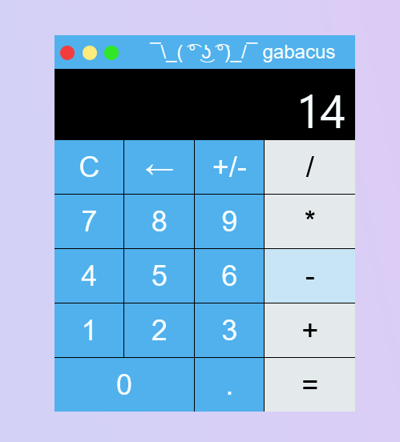
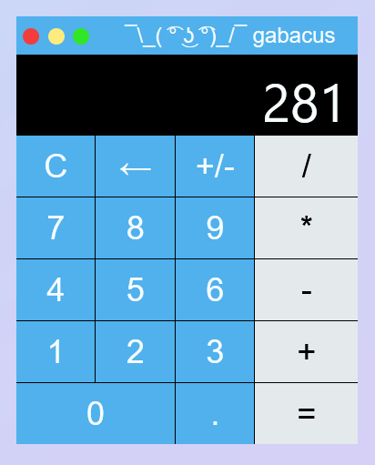

# :heavy_plus_sign: Gabacus Calculator :heavy_minus_sign:

## Table of Contents
- [About](#about)
- [Installation](#installation)
- [Calculator Operation](#calculator-operation)
- [Commands / Features](#commands--features)
- [Credit](#credit)

## About
The Gabacus is the first fully-fledged web-dev project I've developed outside of an academic setting, with the functionality, design, and feature integrations being self-taught over the course of a few weeks. It combines HTML/CSS/JS into a packaged arithemtic calculator. The structure of the calculator was created in a manner reminiscent of the OOCSS (Object Oriented Cascading Style Sheets) methodology, in which element containers are defined as separate entities from their respective skins, from which more precise aesthetic and functional purposes are realized.

## Installation
Given the project's nature, testing its functionality and operation is quite simple.
1. Download the repository.
2. Extract the repository.
3. Locate index.html within the repository, and drag it into a URL of your choosing.

## Calculator Operation
The keyboard is bounded by the limitations of JavaScript computation, and that of machine number arithmetic. That is, absurdly high and low numbers may trigger unpredictable behavior due to the handling of floating point numbers in JavaScript.

To operate the calculator, enter the first operand, and then choose an operation to perform. Then, enter the final number in the operation. From this point, you may obtain your evaluation by two means:
1. Pressing the `=` button on the bottom-right of the calculator.
2. Selecting another operand (`/`, `*`, `-`, or `+`) on the right-hand side of the calculator.

> [!NOTE]  
> The second means of evaluation will display the result of the previous operation, and allow the user to immediately begin entering a second operand to perform with the result.

#### From this point, you are ready to experiment with the Gabacus!

## Commands / Features

### Calculator Commands

The calculator features keyboard support for operand and operator input, as well as commands to change operand sign, and clear the content of the calculator. The following below list the keyboard functionality of the keyboard:

- Digits `0`-`9`: Enters the corresponding number for the operand.
- `Shift + '=' (or '+')`: Enters the addition operation.
- `-`: Enters the subtraction operation.
- `Shift + '8' (or '*')`: Enters the multiplication operation.
- `Shift + '/'`: Enters the division operation.
- `Shift + ';' (or ':')`: Changes the sign of the current operand.
- `.`: Enters a decimal for the current operand.
- `← (or 'Backspace')`: Clears all contents of the calculator (including all stored operands, current operand, and current operator).
- `Enter`: Performs the evaluation of the current operands, and operation.

### Calculator Features
The calculator allows for the evaluation of two operands with the four primary arithmetic operators. The calculator displays real time input, and output of such operations, and supports keyboard functionality in the receival of user input. The calculator has several design features that make the experience feel more interactive for the user, such as visual feedback on buttons, as well as auditory feedback on the input of operands, operators, and on calculator evaluation.

Another aesthetic feature of the calculator is the modification of calculator accent color based on the current operand's sign, wherein the calculator turns red when dealing with negative inputs, and baby blue for positive inputs.

  

## Credit
Sound effects used in this calculator were provided from the royalty-free sound effect archive of [Pixabay](https://pixabay.com/)

### Enjoy! :white_check_mark:
[Back to Top](#table-of-contents)

